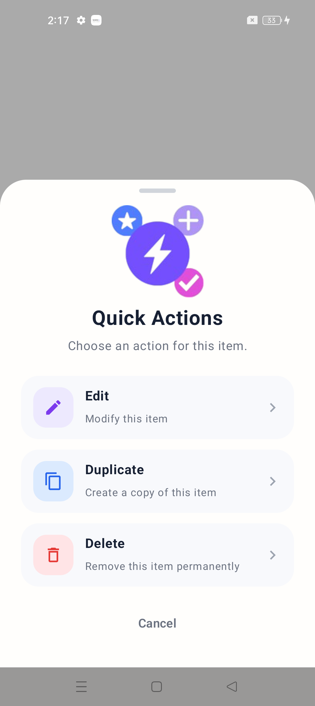
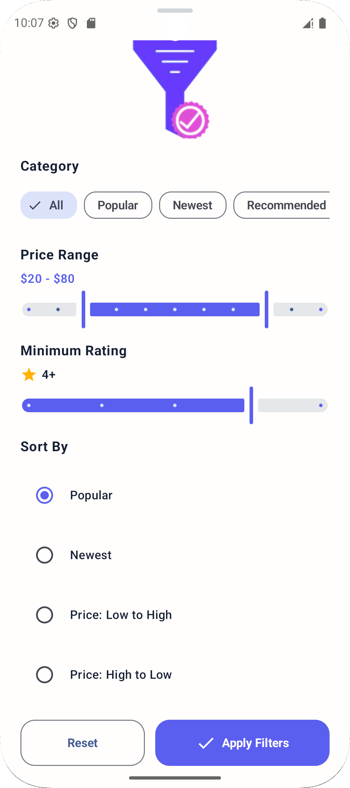
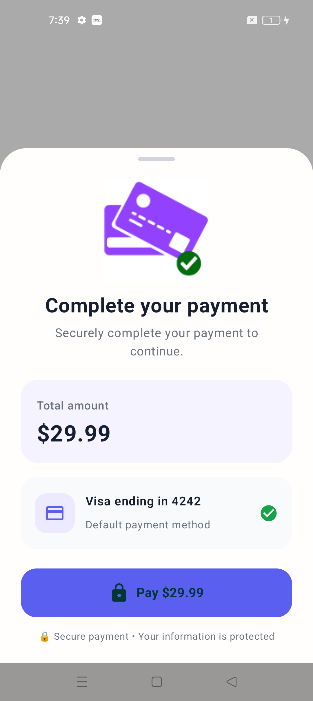

# Bottom Sheet Components

A collection of modern and reusable **Bottom Sheet UI components** designed in **Canva** and implemented using **Kotlin and Jetpack Compose**.

Each component includes a custom Canva illustration/design along with reusable Jetpack Compose source code for Android applications.

---

## Components

### 1. Action Bottom Sheet

A modern action Bottom Sheet with quick actions such as Edit, Duplicate, Delete, and Cancel.

The UI illustration was designed in **Canva** and recreated using Jetpack Compose.

  

**Source Code:**  
[`ActionBottomSheet.kt`](./Action_BottomSheet.kt)

---

### 2. Share Bottom Sheet

A modern and reusable Bottom Sheet for sharing content through different sharing options.

The UI illustration was designed in **Canva** and implemented using Jetpack Compose.

  

**Source Code:**  
[`ShareBottomSheet.kt`](./Share_BottomSheet.kt)

---

### 3. Filter Bottom Sheet

A clean and modern Filter Bottom Sheet for selecting and applying different filtering options.

The UI illustration was designed in **Canva** and implemented using Jetpack Compose.

  

**Source Code:**  
[`FilterBottomSheet.kt`](./Filter_BottomSheet.kt)

---

### 4. Payment Bottom Sheet

A modern Payment Bottom Sheet designed for displaying payment methods and payment-related actions.

The UI illustration was designed in **Canva** and implemented using Jetpack Compose.

  

**Source Code:**  
[`PaymentBottomSheet.kt`](./Payment_BottomSheet.kt)

---

### 5. Profile Bottom Sheet

A modern Profile Bottom Sheet for displaying user profile information and profile-related actions.

The UI illustration was designed in **Canva** and implemented using Jetpack Compose.

  

**Source Code:**  
[`ProfileBottomSheet.kt`](./Profile_BottomSheet.kt)

---

## Built With

- **Kotlin**
- **Jetpack Compose**
- **Material 3**
- **Android Studio**
- **Canva**

---

## Features

- Modern Bottom Sheet designs
- Canva-designed illustrations
- Reusable Jetpack Compose components
- Clean and responsive UI
- Material 3 design
- Custom colors and shapes
- Interactive actions
- Easy customization
- Beginner-friendly source code
- Ready to use in Android projects

---

## How to Use

1. Open the Bottom Sheet component you want to use.
2. Open the corresponding Kotlin source file.
3. Copy the required Composable functions.
4. Add the required imports and dependencies.
5. Copy the required Canva illustration from the `image` folder.
6. Add the image to your Android project's `drawable` resources.
7. Customize colors, text, icons, dimensions, and actions as needed.

---

## Components Preview

  
  
  

  
  

---

## YouTube Tutorials

Step-by-step tutorials for these Jetpack Compose Bottom Sheet components are available on my YouTube channel.

The tutorials demonstrate how to create the **UI illustrations in Canva** and implement the components from scratch using **Kotlin, Jetpack Compose, and Material 3**.

🎥 **[Watch the Complete Bottom Sheet Component Series]([YOUR_PLAYLIST_LINK](https://www.youtube.com/playlist?list=PLTfv16kn5Vg0))**

## License

You are free to use, modify, and integrate these components into your own Android projects.
